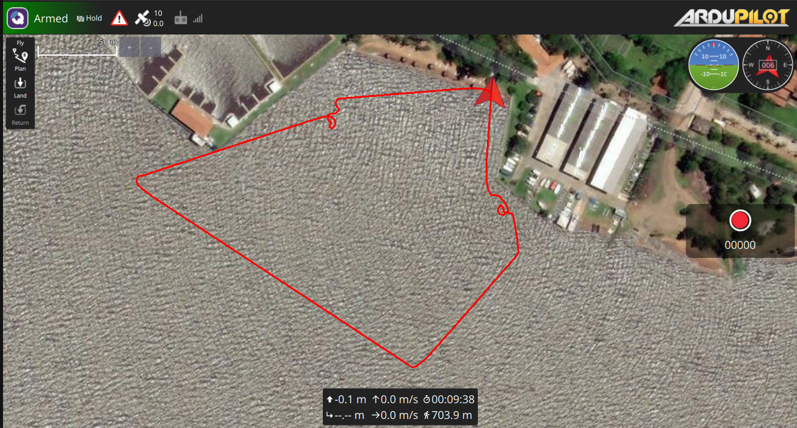

# Simulacion Sistema-Navegacion-ASV



# Sistema-Navegacion-ASV
Desarrollado en Dronekit con Python, posee un simulador de obstáculos para indicar la ubicación de los mismos. El programa intenta generar puntos aleatorios en direcciones cardinales contrarias a donde se indica se encuentra el objeto

# Repositorio de Dronekit con Simulador de Obstáculos

¡Bienvenido al repositorio de Dronekit con Simulador de Obstáculos! Este proyecto está desarrollado en Python utilizando Dronekit, una biblioteca que permite interactuar con vehículos aéreos no tripulados (UAV) de forma programática. El objetivo de este programa es generar puntos aleatorios en direcciones cardinales contrarias a la ubicación indicada de un objeto, con el fin de evitar posibles obstáculos durante la navegación del dron.

## Archivos Principales

- `avoid.py`: Este archivo contiene el programa de navegación principal. Aquí se implementa la lógica para generar los puntos aleatorios en dirección contraria a la ubicación del objeto y se controla el movimiento del dron para evitar colisiones.

- `bandera_obstaculos.py`: En este archivo se encuentra el programa del servidor Flask que se encarga de comunicarse con el programa `avoid.py`. Este servidor actúa como una interfaz entre el dron y el simulador de obstáculos.

- `simulador_de_obstaculos.py`: El simulador de obstáculos está implementado en este archivo. Su función es indicar la ubicación de los obstáculos y comunicarse con el programa de navegación para informarle la posición de los mismos.

## Configuración y Visualización

Antes de comenzar a utilizar este proyecto, asegúrate de seguir los siguientes pasos:

1. Activa el entorno virtual ejecutando el siguiente comando en tu terminal:

```source myenv36_new/bin/activate ```

2. Para visualizar la simulación, ejecuta el siguiente comando:
 
```./QGroundControl.AppImage ```

3. Inicializa el simulador ejecutando el siguiente comando en tu terminal:

```dronekit-sitl rover --home=-25.313745,-57.297215,10,0```

4. Ejecuta el servidor Flask para comunicar con el programa de navegación:

```python bandera_obstaculos.py```

5. Inicia el simulador de obstáculos:

```python simulador_de_obstaculos.py```

6. Por último, ejecuta el programa de navegación:

```python avoid.py```

## Contribución

Si deseas contribuir a este repositorio, ¡estamos encantados de recibir tus aportes! Puedes enviar tus propuestas de mejora a través de pull requests. Asegúrate de seguir las mejores prácticas de desarrollo y de incluir una descripción clara de tus cambios.

## Problemas

Si encuentras algún problema o tienes alguna pregunta relacionada con este repositorio, no dudes en abrir un issue. Estaremos encantados de ayudarte y resolver cualquier inconveniente que puedas tener.

¡Gracias por tu interés en este proyecto! Esperamos que te diviertas explorando y desarrollando con Dronekit y el simulador de obstáculos. ¡Feliz vuelo!
